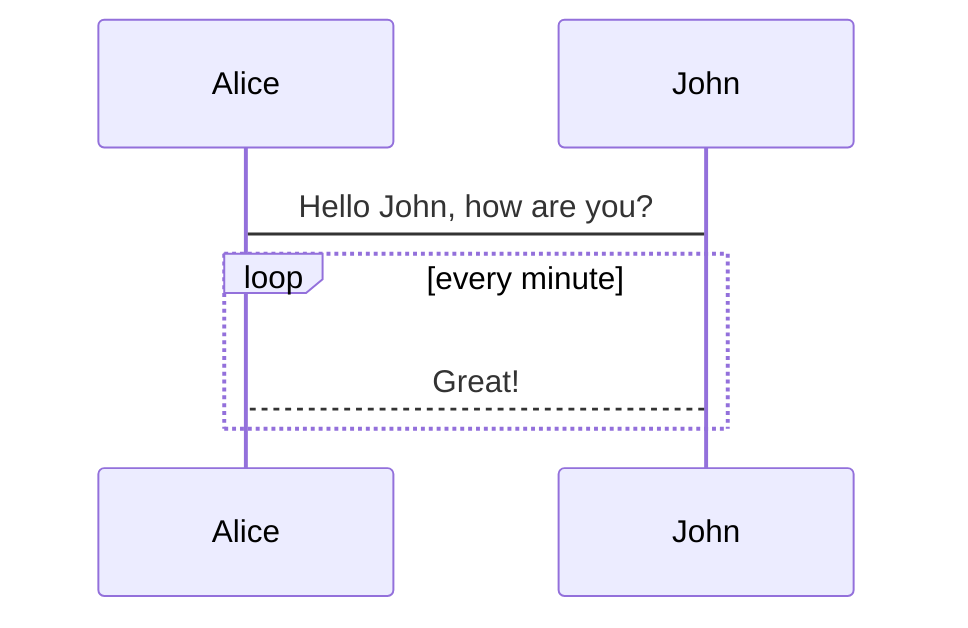
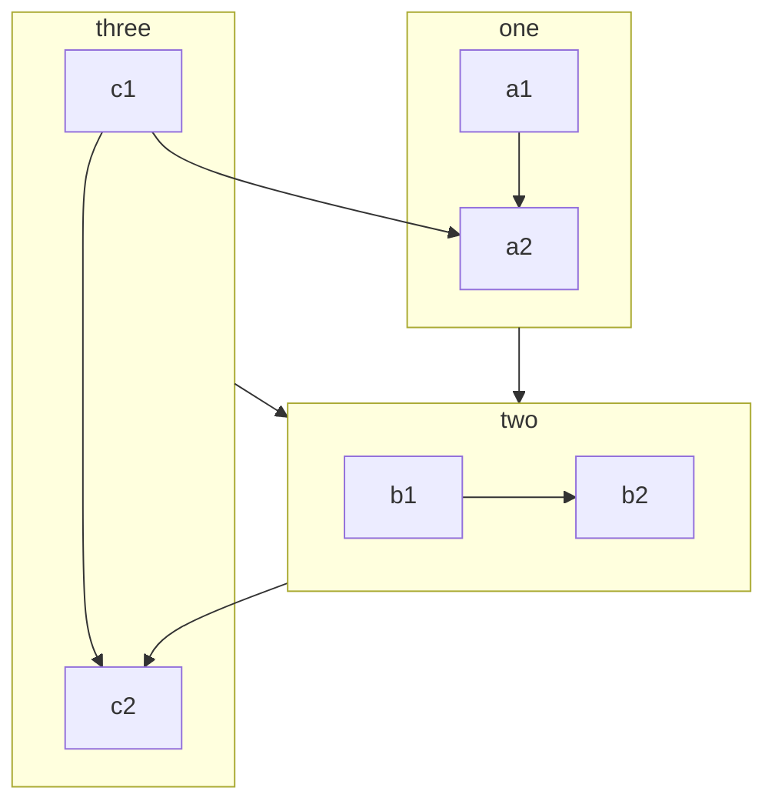

###
法撒旦客服打顺风快递师傅扣篮大赛克里夫啊师傅库萨克得分尔卡就可安防ea飞洒地方啊手动阀啊是粉色饿啊分阿尔法a'sease发阿尔法阿尔法发额费案说法阿瑟饿发违法尔瓦夫安文丰安文丰安文丰aa为分啊阿迪斯发违法啊v违法阿尔法瑟夫暗示







$$
\frac {\partial^r} {\partial \omega^r} \left(\frac {y^{\omega}} {\omega}\right)
= \left(\frac {y^{\omega}} {\omega}\right) \left\{(\log y)^r + \sum_{i=1}^r \frac {(-1)^i r \cdots (r-i+1) (\log y)^{r-i}} {\omega^i} \right\}
$$


:::: tabs
::: tab 这是一个项目
1+1=2dfaf
adsf  
:::
::: tab 项目2
2131232132
:::
::::

:::: tabs cache-lifetime="10" :options="{ useUrlFragment: false }"
 
::: tab "Tab Title" id="first-tab"
__markdown content__
:::
 
 
::: tab javascript id="second-tab"
``` javascript
() => {
  console.log('JavaScript code example')
}
```
:::
 
::::


:::: tabs
 
::: tab title
__markdown content__
:::
 
 
::: tab javascript
``` javascript
() => {
  console.log('Javascript code example')
}
```
:::
 
::::

:::: tabs :options="{ useUrlFragment: false }"

::: tab JS

```js
module.exports = {
    plugins: [
        {
            name: 'custom-plugins',
            globalUIComponents: ["LastReadingPopup"] // 2.x 版本 globalUIComponents 改名为 clientAppRootComponentFiles
        }
    ],
}
```

:::

::: tab TS

```ts
import { UserPlugins } from 'vuepress/config'
plugins: <UserPlugins>[
    [
    	{
        	name: 'custom-plugins',
        	globalUIComponents: ["LastReadingPopup"] // 2.x 版本 globalUIComponents 改名为 clientAppRootComponentFiles
    	}
    ]
]
```

:::

::::