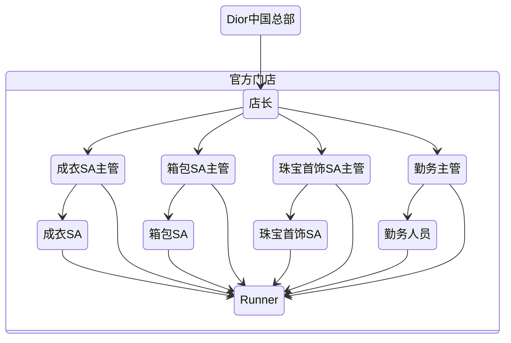

迪奥的工作机会可以说是一次非常有意思的巧合，投递简历后过了快一个月，才接到电话说缺人，随后就过来上班了。来看看这份工作可以给我的社会调查增加怎么样的有趣素材more

## 企业背景
迪奥作为一家法资外企，隶属于LVHM集团，专营各类奢侈品，是本次调查的同阶同行业中的较高位置。店铺在职人员有50多人，店铺面积超过400平，库存各类服饰数千件，各类珠宝数不胜数，店铺库存总资产破亿。

## 岗位信息
### Runner
就职岗位为runner，可以直接理解为店内的跑腿。属于兼职岗位，合同签署方为上海任仕达，不属于Dior编制。是一家服务其他企业临时用人的公司。工作地点为迪奥专卖店。薪资按日计算，每日300，工作八小时，吃饭一小时，分早中晚三班，根据用人单位需求按需排班，无餐补交通补。做5休2，月休8~9天。预估工资6600元。每月18号结算上月工资并由三方公司结算。由于不是Dior正式员工，没法使用Dior star库存管理软件，部分工作开展容易受阻。

::: info 工作时间
早班: 9:00-18:00
中班: 11:00-20:00
晚班: 13:00-22:00
> 周五至周日由于万象城关门时间延后半小时，晚班为13:30-22:30

:::

### 实习生
主要是针对在校大学生，和Dior直接签署实习合同，属于Dior编制，日薪200，工作时间同Runner，享受餐补和交通补，可使用Dior Star库存软件。其余岗位细节基本同Runner。

### SA
由于销售人员的薪资是有较高保密等级的，但可以肯定的是薪资的组成结构大致分为：底薪、集体奖金（店铺经营情况）、个人销售提成
## 店铺组织结构
店铺的人员结构分为SA销售人员、勤务人员、和Runner兼职。具体的职能部门如下图所示。从图中可以很轻松的看出我所从事的Runner就是为了服务众多的职能部门，而现实的工作也基本围绕各类辅助打下手的工作。

::: tip
这里还有些诸如安保部门、保洁部门、改衣部门等没有列举出来
:::

