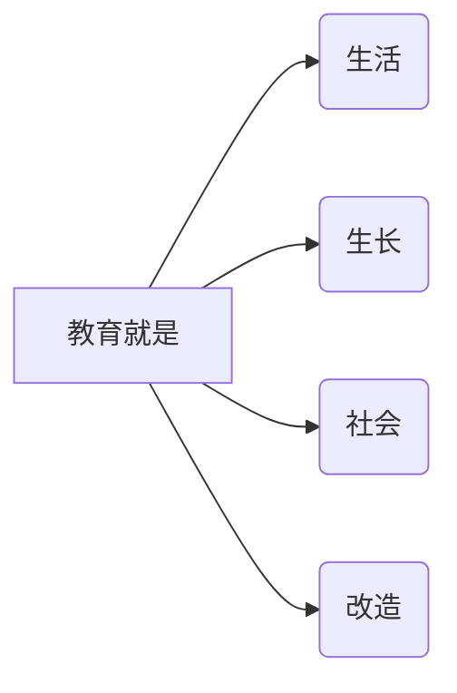
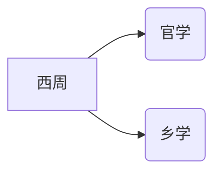

## 第一部分：教育学概述

### 1.0 研究对象

肯定是教育啦~ 怎么更好的教育，教育的意义巴拉巴拉


### 1.0 研究任务

揭示教育**规律**，探究教育的**价值观念**和**教育的艺术**。


### 1.1 发展阶段一：教育学的萌芽阶段

中国：《学记》竹简上的，只有1200字，但非常深刻的讨论了教育和政治的关系（是世界想最早的相关著作

西方：昆体良 —— 培养演说家

> 但是在古代社会（原始 ——》奴隶社会 ——》封建社会）都是非独立学科，只是有了学科萌芽。
<!-- more -->


### 1.2 发展阶段二：教育学作为独立学科出现

出现的本质原因是1840年人类迈入工业化社会之后，生产力大幅度发展。无论是科技、文化、政治、经济都出现大幅进步，这都为教育学的出现提供了物质基础。

**原因：**

1. 生产力提升，实践的知识需求提高
2. 近代科学的高速发展，远超古代总和
3. 跟随生产力发展而出现的大量著名教育人士
4. 知识开始逐渐沉淀

**标志：**

1. 成为了专门的学术领域
2. 独有的概念出现了
3. 有了更为科学的研究方法
4. 开始出现相关著作（相较于以前片面的内容，更为完整，系统化）
5. 各种研究机构开始出现


**详解：教育学（走向独立学科）的过程**

| 年份   | 代表人物   | 特征点                                                       |
| ------ | ---------- | ------------------------------------------------------------ |
| 1632年 | 夸美纽斯   | 班级授课的形式出现了（延续至今）                             |
| 1693年 | 洛克       | 教育三大件：德育、智育、体育                                 |
| 1776年 | 康德       | 教育学进入大学课堂                                           |
| 1781年 | 裴斯泰洛齐 | 教育学心理学化，与心理学密切结合                             |
| 1806年 | 赫尔巴特   | 继承夸美纽斯和裴斯泰洛齐，推动教育学由实践性制度走向学术性学科（祖师爷） |


### 2.1 发展出的教育学流派

#### 1. 实验教育学

一切以实验研究为基础进行量化，产出结果

假设 ——》实验 ——》 证明

> 与赫尔巴特有对立性，强调实验，反对思辨（赫尔巴特强调思辨）

优点：严谨性高，依据性强

缺点：有唯科学主义的嫌疑，过度依赖实验


#### 2. 文化教育学

是与实验教育学互相对立的教育学派，秉持人是一种文化存在。

教育方针是：将人类的文化内化给学生

精神或文化科学方法、思辨、陶冶情操、唤醒


#### 3. 实用主义教育学

这个流派是杜威的，就是胡适那叼毛天天追捧的老师。但杜威本人确实在教育上造诣很深。




疑问：为什么是对赫尔巴特的批判呢？


#### 4. 马克思主义教育学

最早将其付诸实践的是毛子，是对马克思主义教育学部分的第一次实践

教育是生产力再生产的过程

是培养人全面发展的手段

教育必须与生产劳动相结合

> 番外问题：为什么容易机械化，教条话，甚至政治化？


优点：充分应用马克思主义这一全新的唯物主义分析方法，具有相当的科学性

缺点：实践中因为种种原因，很容易出现机械化、教条话、政治化的问题


#### 5. 制度教育学 

很多强调对于制度的批判，要分析制度，让制度为教育所用

优点：重视制度

缺点：过度依赖精神分析？


#### 6. 批判教育学

1970年代

注重敏感性，要对周边事物保持敏感性

继承了马克思的批判方法

批判了资本主义的教育

但是批判的太深刻，却没有啥有用的改进方法


### 2.2 回到当代教育学：进入理论深化阶段

#### 1. 新课改：用到的教育目标分类学

将教育目标氛围认知、情感、动作，对教育评价有重大意义


#### 2. 知识结构学

主张要让学生了解知识结构，结构很重要，用结构引导学生自己理解领悟


#### 3. 苏联教育思想

实验，与教学最优化巴拉巴拉


#### 4. 我国的教育学思想

中国的教育发展其实非常有历史，有很多研究

研究的很广泛

这个时期的教育学研究出现了很多新特征：

- 问题领域光速扩大
- 研究基础研究模式多样化
- 细化特别多，很多都可以研究
- 教育学研究与实践改革的关系更密切了
- 教育学加强了对自身的反思，出现元原理（元化概念？）


---

<br><br><br><br><br>


## 第二部分： 中国教育史

教育史的学习的重要性仅次于教育学，要结合历史学习教育史

**中国古代教育史发展轨迹：**

儒学 --》经学（董仲舒） --》 理学（朱熹）

> 核心都是儒学


### 古代教育史

从原始社会开始，教育是人类传授生存技能必要的部分，分为家庭教育和社会教育。


#### 第一部分：奴隶社会教育史

列最为具有代表性的西周，西周是中国奴隶社会的发展巅峰，达到了奴隶社会生产力的顶峰。

为此生产力开始在统治阶级和贵族、富裕奴隶主等群体中出现富余，这部分人可以将脑力和体力活动分开，开始专门为教育腾出手，培养下一代，以维系统治地位。于是出现了学校。

分为：官学（西周）




#### 第二部分：封建时期教育学

私学的出现（东周）

秦汉魏晋南北朝

儒学经学  封建社会上升阶段


#### 第三部分：封建时代后期

明清理学，封建走向衰败


### 第四部分：跨入近代化教育

教育步入近代化进程：

Part1：

​	近代化教育起步：洋务运动，由外到内

​	建立

​	改革

Part2：

​	国共两套教育体制

​	现代教育理论实践

<br><br><br><br><br>

## 第三部分：教育心理学

理解很重要

框架：一共九章

两大块：学 和 教（给学生）

一二章：

所以要先研究人的心理

```txt
{
	认知{
		共性
		差异
	}	
	人格
}
```


第三章：学习是什么？怎么学？

第四章：动力动机


五：只是的构建

技能形成


7：学习策略及教学

8：问题解决能力和创造能力

一般人 / 有创造能力的人


9：社会规范学习与品德发展

10：心理健康教育


重点2、3、4章占据80%的考点


### 学科研究对象

教育学和心理学的交叉学科

学习心理

教学心理

学生心理

教师心理


### 研究任务

揭示规律

运用规律


### 历史发展

**古代思想起源**

古代的圣人的教育思想，孔子苏格拉底


**近代思想起源**

西方文艺复兴后 高尔顿（达尔文亲戚）

德国人冯特：1879年莱比锡大学创建了第一个心理学实验室，实验法引入了学科

完成了由哲学转换成了科学


美帝的行为主义学派，认知学派起来了，反超了德国

**教育学思想的发展：** 裴斯泰洛齐：教育心理学化 

赫尔巴特：教学的过程要运用心理学规律，发展了教育四阶段，有发展成五阶段


初创期


发展时期


成熟期 60s-70s


深化时期  80s-至今