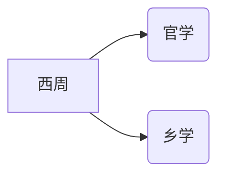
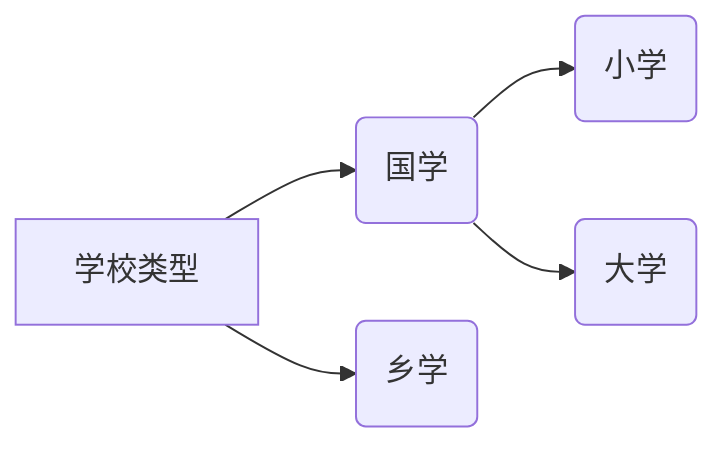

## 中国教育史前言

教育史的学习的重要性仅次于教育学，要结合历史学习教育史

**中国古代教育史发展轨迹：**

儒学 --》经学（董仲舒） --》 理学（朱熹）

> 核心都是儒学
<!-- more -->

### 古代教育史

从原始社会开始，教育是人类传授生存技能必要的部分，分为家庭教育和社会教育。

#### 第一部分：奴隶社会教育史

列最为具有代表性的西周，西周是中国奴隶社会的发展巅峰，达到了奴隶社会生产力的顶峰。

为此生产力开始在统治阶级和贵族、富裕奴隶主等群体中出现富余，这部分人可以将脑力和体力活动分开，开始专门为教育腾出手，培养下一代，以维系统治地位。于是出现了学校。

分为：官学（西周）

#### 第二部分：封建时期教育学

私学的出现（东周）

秦汉魏晋南北朝

儒学经学  封建社会上升阶段

#### 第三部分：封建时代后期

明清理学，封建走向衰败

### 第四部分：跨入近代化教育

教育步入近代化进程：

Part1：

​	近代化教育起步：洋务运动，由外到内

​	建立

​	改革

Part2：

​	国共两套教育体制

​	现代教育理论实践

## 1.0 古代社会的教育史

## 1.1 原始社会的教育

夏商朝代的教育更多的是传说，有很多关于学校的传说，但缺少实际的考古发现

> **所以该阶段的重点在西周**

## 1.2 奴隶社会的教育

### 1.2.1 分析学校产生的条件

首先说明：教育是人类社会发展的产物，与生产力有关。原始社会也存在教育，但是是 **家庭教育+社会教育 **为主。

> 方法论三板斧：政治、经济、文化三角度

经过奴隶社会的高速发展（西周是中国奴隶社会的顶峰），生产力全面超越以往原始社会的任何阶段，这有力的促进了教育的发展，并因此发生了质变而产生了学校。

**学校教育出现的条件：**

- 生产力出现富裕，可以体脑分工。

- 文字的出现，有载体
- 社会发展一些年了，能教的多了

### 1.2.2 学校的类型：

五帝时期（原始社会）：“成均” “庠”两种类型的学校

夏朝需要开疆拓土，和武力关系较多，所以称为“序”、“校”

商朝就出现的学校：右学（大学）左学（小学）

> 有很多教学内容和“乐”相关，是因为当时生产力落后，科技落后，对很多自然现象没办法解答，人们会倾向于用乐理来解释，并传授给下一代。

---

### 1.2.3 官学制度与六艺教育：奴隶社会的教育体制

---

#### 西周的教育制度

西周时期都是官府掌控教育

**西周教育概览**

> 25户设为一闾
>
> 5族为党
>
> 5党为州
>
> 5州为乡

1. **国学**

   位置：设置在王都内

   小学、大学的总成，称为“中央官学”，专为贵族设置。

   **大学：**

   ​	9年制度

   ​	礼乐优先，御箭（御是骑马，箭是射箭）次之重要

   ​	7年小考核，通过称为**小成**

   ​	9年大考核，通过称为**大成**

   **小学：**

   

   

   

2. **乡学**

   > 称为地方官学

   位置：各地方

   招人：奴隶主和平民子弟

   

   六德、行、艺

   **学习优异可以考核进入大学学习，这点很重要，意味着可以通过学习改变自己的阶层**

   > 以上西周是不会有私学的。

   

#### 西周是最早开始家庭教育的朝代

7岁就要开展家庭教育

还是全世界胎教出现最早的国家

#### 官师合一，不是独立社会职业

基本是由官员兼任老师，没有出现全职的老师

#### 六艺教育介绍

基本的教育内容

教育的特征

礼、乐、射、御、书、数

| 科目           | 所属阶段 | 称呼 |
| -------------- | -------- | ---- |
| 书、数         | 小学课程 | 小艺 |
| 礼、乐、射、御 | 大学课程 | 大艺 |

**礼乐：**

礼重道德，乐注重艺术，陶冶情操

**射御：**

“射”、“御”是军事课

**书数：**

[shǐ zhòu piān]史籀篇：中国教育史记载的最早的儿童识字课本

 

**六艺教育的特点：**

重视思想道德，也重视文化

符合历史规律，对中国的历史产生了巨大的影响

### 1.2.4 私人讲学：奴隶社会步入封建社会

---

出现了新的教育思想——为私学的发展起到奠基作用

私学兴起 ——> 百家争鸣 ——> [[稷下学宫（战国时期高等学府）_百度百科 (baidu.com)](https://baike.baidu.com/item/稷下学宫/1508021?fr=aladdin)]

在这其中：

**儒家兴起，墨家也兴起 共称为显学。**

道家法家（另外两家）也是相当有名，为最后形成战国后期的大量教育论著提供了基础

#### 产生的原因

**出现的本质原因：**

社会生产力得到长足发展，达到奴隶社会的发展顶峰，地方势力开始反超天子。地方对于乡学较差的教育资源不满，开始自行解决后代教育问题。

**表现为政经文的下放：**

1. 经济发展出现私人所有的土地（地主出现了），[井田制](https://baike.baidu.com/item/井田制/91855?fr=aladdin)瓦解
2. 礼乐崩坏，礼乐管不住啦（威严不如以前，生产力强大，奴隶主反超天子）
3. 士阶级兴起，大家都开始养士

> 井田制是奴隶社会时期的土地模式，代表奴隶要大量被白嫖种天子的共田，自己的私田只能供给自己的生存。随着奴隶主之间的土地兼并，势力逐渐强大，而天子势力衰弱（对方原因），开始出现大量自耕农，和带有封建社会性质的地主（与自耕农发展租赁关系）

#### 私学特点

#### 意义

可以自由讲学啦

扩大了受教育对象的范围（平民都可以）

促成了大量的学术派别，百家争鸣：因此提出了很多自己的政治观点，又促进了教育的发展

私学 ———》 百家产生 ————》私学 **相互促进，共同发展**

因为上面写的发展养士之风开始盛行

#### 春秋时期的国立高等学府：齐国的稷(ji)下学宫

从百家私学讲学又成了官家举办，但由私人主持讲学的特殊学校。

集成讲学、写书著作、育才活动对方为一体，甚至能议论政策，提供政见（给政府提供）。

**特点：**

学术自由

待遇优厚（经济地位很高）

学生可以选择很多的老师，很自由

最早的学生守则产生了《弟子职》

#### 私学部分很重要，单独拿出来

#### 01 教师的祖师爷——孔子的教育实践与教育思想

1. 开创性，造诣

开创了私人自由讲学的风气（30岁就开始讲学）

整理了《诗》《书》《礼》《易》《乐》《春秋》六经，总结了以前的文化

承前启后，从旧的六艺转向 ——》 **新六艺**

2. 教育的作用

可通过教育让人发生了变化 

> 遗传、环境、教育、主观能动性    影响人发展的几大要素

性相近，习相远

刚出生性很相近，学习后就距离远了。教育对一个人的作用很大呀，直接和今天的教育原理挂钩了

第一点：治理一个国家三要素：人口增加，富裕起来，教育起来

孔子理解的很深呀，教育和政治关系也很大（强调德政，教育为政治服务）

重教育兴学的传统，为中华文明延续至今，发挥了巨大的作用

3. 孔子的教育对象

强调有教无类，不分贵贱，人人都可以受教育

倡导教育公平，很先进的教育思想。

4. 学而优则仕 与教育目的

**正面性：**可以为封建统治阶层提供新鲜血液，不让统治阶级固化，这对于西周的教育是降维打击，打破了世袭制，有利于社会发展。

**反面性：万般皆下品，惟有读书高。变相不利于社会的发展了**

5. 教育内容：

| 书       | 书名全称                                                     | 注释                                 |
| -------- | ------------------------------------------------------------ | ------------------------------------ |
| 《诗》   | 《[诗经](https://baike.baidu.com/item/诗经/168138?fromModule=lemma_inlink)》 | 我国历史上第一部诗歌总集             |
| 《书》   | 《[书经](https://baike.baidu.com/item/书经/730936?fromModule=lemma_inlink)》(即《尚书》 | 这是周王室外史所藏的政治文件，编年体 |
| 《礼》   | 《[仪礼](https://baike.baidu.com/item/仪礼/5394977?fromModule=lemma_inlink)》 | 礼仪，约束人的思想道德               |
| 《易》   | 《[易经](https://baike.baidu.com/item/易经/153636?fromModule=lemma_inlink)》(即《[周易](https://baike.baidu.com/item/周易/6219?fromModule=lemma_inlink)》) | 群经之首，中国哲学源头，思辨性很强   |
| 《乐》   | 《[乐经](https://baike.baidu.com/item/乐经/8784433?fromModule=lemma_inlink)》 | 隶属周王室司乐的音乐作品             |
| 《春秋》 | 《春秋》                                                     | 记录历史，春秋是先秦对史书的通称     |

**教学内容的特点**

重社会人文，轻宗教

重文，轻武

轻科技、生产力相关，自然知识比较贫乏

6. 教学方法

因材施教

启发诱导，强调独立思考

思行并重

不耻下问，实事求是，态度好学

7. 道德

仁礼：德育至上

德育重在行办，强调克己

8. 论教师

学而不厌，诲人不倦，教学相长

9. 历史影响

已经有教育学原理中的

- 原理
- 功能目的
- 内容
- 方法
- 德育

#### 02 孟轲——孔子最好的弟子

> 孟子人称亚圣，继承孔子的仁学思想

**性善论**

强调人与动物的区别

通过教育扩张人的善

**“明人伦”与教育目的**

培养人才为教育服务

> 人伦：社会秩序

**深造“自”得——自己的领悟**

盈科而进：学好了再往前

教亦多术：教人的方法有很多种

专心致志：认真专心

#### 03 荀子——稷下学宫任职过

**1. 礼法并重**

> 法家思想在战国后期为秦国重用，并最终实现了大一统

**2. 性恶论**

先天都是自私的，伪善的，需要后天的努力学习来改变

化性起伪

**3. 设定成就等级：**

大儒

俗儒

雅儒

大儒是最理想的一类人才，知识广博，能以浅持搏，以古持今，以一持万

**4. 以儒家经典为讲课内容**

荀子重视儒家经典的传播，尤其是《礼》、《乐》

**5. “闻见知行”结合的学习过程**

孟子“内求”，荀子“外铄”

> 孟子性善论，强调向内发掘人性的美好。
>
> 荀子性恶论，强调需要靠外力来改变人的恶。

学与思的关系上，侧重于“学”

学习的过程：

闻见：外在的体会，感受

知：理性认识，掌握内在规律

行：实践，践行

> 孔子是学——思——行

学习方法：

1. 善假于物：善于是用外在事物，促进自己的发展
2. 兼陈中衡：在学习过程中如何保持平衡统一，类似孔子的中庸思想
3. 虚一而静：专心致志

**6. 论教师**

重视教师的作用和地位

对教师也提出了非常严格的要求

师生关系强调尊重，学生努力进步，勇于超过老师

片面强调服从教师

