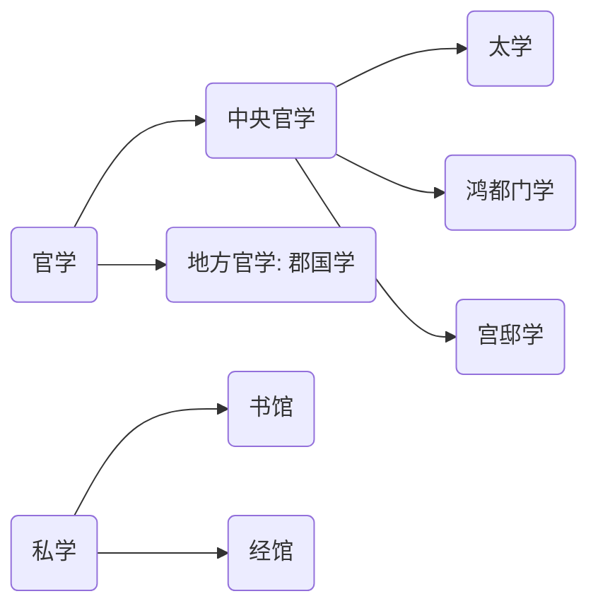

## 第三章 儒学独尊与读经做官教育模式初步形成

1. 秦代教育政策与措施
2. 汉代教育政策
3. 汉代学校
4. 察举制
5. 教育家董仲舒
6. 教育家王充
<!-- more -->

  

  

### 一、秦朝教育政策与措施

作为中国历史上第一个中央集权的国家，才用法家商鞅的思想，统一秦人的思想。

在国家统一后，为了维护国家的统一和中央集权的政治制度，开始推行如下政策。

- 统一文学
- 严禁私学，“焚书坑儒”

- 推行吏师制度

> 吏师制度是秦朝独具特色的教育体系，吏即官吏，以官吏为师进行学习，学习的内容几乎都是秦朝的法律知识。

    

### 二、汉朝“独尊儒术”政策的确立过程

1.汉初**教育政策：各家并存**，推崇“黄老之学”，提倡无为而治

- 轻徭薄赋
- 减轻刑法
- 减免田租
- 与民休息

> 经过汉初的休养生息，各地经济迅速恢复，但由于无为而治强调片面放养式发展，降低税收等，导致地方诸侯势力逐渐走强，中央的地位反而被削弱了。
>
> 与此同时匈奴扰边问题等外部威胁愈发明显，在文景之治后迫切需要人站出来解决。

2.汉武帝为解决内部和外部的种种问题，**政治上推行“推恩令”，** 削弱国内诸侯豪强的势力； **教育上推行“独尊儒术”**

- 为了实现“大一统”的宏愿，变消极（无为）为积极
- 采纳董仲舒的“罢黜百家，独尊儒术”的教育观点
- 把教育作为巩固统治的重要工具

**因此出现了三大文教政策：**

1. 推孔氏，罢黜百家
2. 兴太学以养士：兴办太学，设置学问高深的老师，以教育培养天下士人
3. 重视选举，选贤举能，推行察举制（官员推荐人选、由官方考核）

**总结——独尊儒术这一文教政策对教育产生的影响**

1. 确定了教育为**治国之本**的地位

   > 孔子虽然一直有论述该观点，但之前一直没有被统治阶级所采纳，直到汉朝独尊

2. 儒家经学成为了教育的**主要内容**

   > 已经不再是民间思想，而是正统思想

3. 儒学不仅是培养人才，还变成**选拔人才的标准**，故归宗攻读儒经（都以儒经作为宗旨进行学习）

 

 

### 三、汉代教育制度的发展（主要是学校）

汉朝为我国封建教育制度发展和完善奠定了基础。汉朝的学校有官学和私学。官学分为中央官学和地方官学。

- 太学：以讲述传授儒家经典为主。
- 鸿都门学：以讲授书法绘画为主，这一所专科学校，也是世界上最早的文学艺术专门学校。
- 宫邸学：为皇室及贵族子弟创办的贵胄学校，另一种是以宫人为教育对象的宫廷学校
- 郡国学：郡国学是为地方设立的学校，这里的国和县是一个概念（因为西周的分封制度在汉朝还有残留）
- 书馆：是对当时缺乏初等教育的补充，主要从事识字和书法教育，后期则开始接触儒学基础内容
- 经馆：这是相较于书馆更高一级的私学，实际是一些著名学者讲学的场所，有部分经馆甚至可以和太学相比

 

#### 太学

**太学产生的历史意义**

**积极：**

1. 汉代太学是中国教育史上第一所有完备规则，有充足的历史资料可考据的学校，首创历代的最高学府，影响深远。
2. 从真正的意义上说，利用学校教育来强化官方的意识形态，始于汉代的太学。

**消极：**

1. 东汉太学生为了反抗黑暗的宦官政治所发动的政治运动，掀开了中国学生运动史上的第1页。
2. 汉代太学、教育中存在排除异己的问题，并且以繁琐考证，空谈义理取代了对现实问题的分析研究，严重束缚了教育思想和学术研究的发展。

 

#### 宫邸学

#### 郡国学

郡国学可以培养地方官吏，也可以向中央输送人才，并且起到了教化的作用

