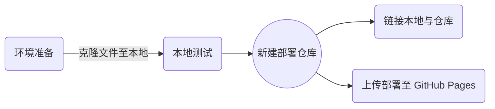

::: tip 提醒
本文是弄Hexo博客时期写的了，转到新博客，教程方法在（2022.10.16）依旧可行，有想做一个简单的静态网站的可以尝试。

Hexo相对来说没Vue那么强的高度可自定义性，这是我转为Vuepress的主要原因
:::

## 前言

静态网站相较于动态网站没有背后的数据库，所以约等于一个用代码生成的图形页面。这样子的优点是成本很低，可以直接部署在 Github 或者 Gitee 上。目前非常多的静态网站使用的框架是 Hexo，相关的资源非常多，且成本低廉可依靠开源平台免费部署并做到**自动负载均衡**，是新手入坑的不二之选。<!-- more -->

::: tip Ⅰ
自动负载均衡可以理解为不用担心有人恶意攻击你的服务器，因为是部署在 Github 等大型平台上，网站已经帮你做好了相关工作
:::

::: tip Ⅱ
本教程时 hexo 框架部署的最新教程， 时间坐标 2022 年 3 月 21 日， 请注意时效， 从目前情况看很多教程乃至 2021 年 8 月的教程都不一定适用， 所以相应的操作教程最好找最新的。
:::
### 教程步骤更新点：

::: danger
必须在隐藏文件 config 文件下加入 user 信息， 填写个人 github id 和邮箱
:::

<br>

### 部署思路图





### 难度分级：一星

不需要什么编程基础，不过需要些计算机操作知识 ( 主要是 CMD/PowerShell 方面 ) ，过程中可能会遇到很多错误 ( 主要是因为电脑没配置控制台相关的框架和设置所致 ) ，但由于前者众多，所有问题都可以在百度搜出来

::: tip Tips
如果搜不出来要多尝试不同的关键词，不到万不得已不去提问 ( 逼自己一把 ) 。要知道这是提高自己自主解决问题及检索关键词凝练能力的绝佳机会，要牢记成为大佬的路大多数得靠自己检索，问别人是解决问题时非常低效的方法且浪费了提高关键词提炼能力的机会
:::

## 搭建思路

安装好 Node.js 和 Git 后根据国内特定网络环境， 可以安装 cnpm ( 中国版 npm ) 以更佳方便的安装 hexo 框架

1.  使用 npm/cnpm 安装 hexo 框架

2.  hexo 框架初始化， 省成本地网页文件

3.  Github/Gitee 建立仓库对应仓库， 并使用 Git 生成专属的 SSH 密钥与各个账户连接

4.  配置本地 hexo 内的网路参数

 > 如账号， 网址链接等信息

5.  使用终端命令上传部署 hexo, 实现网址访问效果

## 前期准备

### 环境配置

**概念解释：**
环境配置可以理解成盖房子，系统就是人在计算机这个平台内创建的一个世界，而各种**环境配置**则可以理解成**盖房子前的打地基以及各种预埋的水管电路**，在这个基础上才好进行建设，以实现自己向要的效果

::: note Node.js
一个基于 Chrome V8 引擎的 JavaScript 运行环境，可以让 js 具有和别的平台性语言同台竞争的机会

下载地址： [Node.js ( nodejs.org )](https://nodejs.org/zh-cn/) 下载长期维护版即可

具体安装文档请参考这篇文章

 [Node.js 安装及环境配置之 Windows 篇 - 刘奇云 - 博客园 ( cnblogs.com )](https://www.cnblogs.com/liuqiyun/p/8133904.html)

> 安装时 `Node` 会自动安装 `npm ( nodepackage manager )` 帮助用户管理各类插件
:::

::: note Git
这是一款非常强大的版本管理软件，不只是可以用于 hexo 部署，还可以管理各类 GitHub 的仓库项目 ( 上传下载 ) 。可以这么说，初学者要想玩转 Github 绝对不能不用 Git

>挖个坑，后面会更新 Git 管理 GitHub 仓库的初级教程
 [Git 版本管理软件使用心得](https://tommyzeng.com/2022/03/05/Git%E7%89%88%E6%9C%AC%E7%AE%A1%E7%90%86%E8%BD%AF%E4%BB%B6%E4%BD%BF%E7%94%A8%E5%BF%83%E5%BE%97/)

下载地址： [Git - Downloading Package ( git-scm.com )](https://git-scm.com/download/win)
> 建议下载 Standalone Installer 版本


<br>

:::


<!--**需要的环境如下**
::: tip Node.js
一个基于 Chrome V8 引擎的 JavaScript 运行环境，可以让 js 具有和别的平台性语言同台竞争的机会

下载地址： [Node.js ( nodejs.org )](https://nodejs.org/zh-cn/) 下载长期维护版即可

具体安装文档请参考这篇文章

 [Node.js 安装及环境配置之 Windows 篇 - 刘奇云 - 博客园 ( cnblogs.com )](https://www.cnblogs.com/liuqiyun/p/8133904.html)

> 安装时 `Node` 会自动安装 `npm ( nodepackage manager )` 帮助用户管理各类插件
:::

::: tip Git
这是一款非常强大的版本管理软件，不只是可以用于 hexo 部署，还可以管理各类 GitHub 的仓库项目 ( 上传下载 ) 。可以这么说，初学者要想玩转 Github 绝对不能不用 Git

>挖个坑，后面会更新 Git 管理 GitHub 仓库的初级教程

下载地址： [Git - Downloading Package ( git-scm.com )](https://git-scm.com/download/win)
> 建议下载 Standalone Installer 版本


:::
-->

<br>
<br>

**环境安装好后的核验代码**

使用 Powershell 或者 CMD 的命令行终端，输入代码后查询

> 不知道怎么打开命令行终端的百度一下就有

```yaml
//版本查询代码，显示出版本表示安装成功
node -v
npm -v
git --version
```

**演示：**


